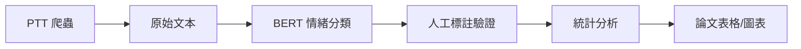

# PTT 情緒分析與股市關聯研究系統

> 一個整合 NLP 情緒分析、人工標註工具與統計檢定的完整研究平台

[](https://www.python.org/)
[](https://flask.palletsprojects.com/)
[](LICENSE)

📊 **[查看專題海報](docs/presentations/poster.pdf)** | 📝 **[閱讀論文](docs/papers/)** | 🎨 **[研究流程圖](docs/presentations/research_flowchart.pdf)**

---

## 📌 專案動機 (Motivation)

本專案旨在探討「PTT 股票板情緒」與「台股大盤走勢」之間的關聯性。透過：

1. **自動化爬蟲** - 收集 PTT Stock 板文章與推文
2. **BERT 情緒分類** - 使用微調後的 Transformer 模型進行三分類（正面/中性/負面）
3. **人工標註系統** - 提供 Web 與桌面雙介面，支援多人協作標註
4. **統計檢定** - 卡方檢定、Spearman 相關性、Bootstrap 信賴區間

最終產出可用於學術論文的統計表格與視覺化圖表。

---

## 🚀 快速啟動 (Quick Start)

> 💡 **新手？** 請先閱讀 [5 分鐘快速啟動指南](QUICKSTART.md)

### 1. 環境需求

- Python 3.8+
- SQLite 3
- (選用) CUDA 11.8+ for GPU 加速

### 2. 安裝依賴

```bash
# 建立虛擬環境
python -m venv venv
source venv/bin/activate  # Windows: venv\Scripts\activate

# 安裝套件
pip install -r requirements.txt
```

### 3. 設定環境變數

```bash
# 複製範本
cp .env.example .env

# 編輯 .env 檔案，填入你的設定
# DB_PATH=database/ptt_data.db
# FLASK_SECRET_KEY=<YOUR_RANDOM_SECRET_KEY>
```

### 4. 執行資料處理 Pipeline

```bash
# Step 1: 資料清洗與特徵工程
python src/pipeline/data_pipeline.py

# Step 2: 統計分析
python src/pipeline/thesis_stats.py
```

### 5. 啟動標註系統

#### Web 介面（多人協作）
```bash
python src/web_app/app.py
# 開啟瀏覽器訪問 http://localhost:8000
```

#### 桌面介面（單人標註）
```bash
python src/desktop_app/advanced_label_tool.py
```

---

## 🏗️ 系統架構 (Architecture)

```
使用者 → Flask Web App → SQLite Database
                ↓
         BERT 模型推論 → 情緒標籤
                ↓
         統計分析模組 → 論文表格/圖表
```

### 核心模組說明

| 模組 | 功能 | 技術棧 |
|------|------|--------|
| `web_app/` | 多人標註系統 | Flask + Jinja2 + SQLite |
| `desktop_app/` | 桌面標註工具 | Tkinter + SQLite |
| `pipeline/` | 資料處理流程 | Pandas + NumPy + SciPy |
| `scripts/` | 實驗性分析腳本 | 各種統計與視覺化工具 |

---

## 📊 資料流程 (Data Pipeline)



1. **資料收集** - 爬取 PTT Stock 板指定期間的文章
2. **情緒分類** - 使用微調後的 `ckiplab/bert-base-chinese` 模型
3. **人工標註** - 透過 Web/Desktop 介面進行三分制標註
4. **統計檢定** - 卡方檢定、Spearman 相關性、Bootstrap CI
5. **視覺化** - 生成 Z-score、MinMax、Diff 等對比圖表

---

## 🔧 技術棧 (Tech Stack)

- **後端框架**: Flask 2.0+
- **資料庫**: SQLite 3
- **NLP 模型**: Hugging Face Transformers (BERT)
- **資料處理**: Pandas, NumPy, SciPy
- **視覺化**: Matplotlib, Seaborn
- **桌面 GUI**: Tkinter

---

## 📁 專案結構 (Project Structure)

```
ptt-sentiment-analysis/
├── src/              # 核心程式碼
├── scripts/          # 實驗性腳本
├── data/             # 資料檔案（raw/processed/outputs）
├── assets/           # 圖表與靜態資源
├── database/         # SQLite 資料庫
├── docs/             # 技術文件
└── tests/            # 單元測試
```

詳細架構請參考 [docs/architecture.md](docs/architecture.md)

---

## 🔐 安全性注意事項 (Security)

⚠️ **重要提醒**：

1. **絕對不要** commit `.env` 檔案到 Git
2. **絕對不要** 在程式碼中硬編碼密碼或 API Keys
3. 資料庫檔案 (`*.db`) 已加入 `.gitignore`
4. 使用 `secrets.token_hex(32)` 生成 Flask SECRET_KEY

---

## 📈 使用範例 (Usage Examples)

### 範例 1：批次預測情緒

```python
from src.utils.sentiment_predictor import predict_batch

texts = ["台積電今天漲停！", "崩盤了..."]
results = predict_batch(texts)
# Output: [2, 0]  # 2=正面, 0=負面
```

### 範例 2：查詢標註進度

```python
from src.utils.db_utils import get_annotation_stats

stats = get_annotation_stats("manual_labels_extra")
print(stats)
# {'Negative': 120, 'Neutral': 85, 'Positive': 95, 'Total': 300}
```

---

## 🤝 貢獻指南 (Contributing)

歡迎提交 Issue 或 Pull Request！

1. Fork 本專案
2. 建立你的功能分支 (`git checkout -b feature/AmazingFeature`)
3. Commit 你的變更 (`git commit -m 'Add some AmazingFeature'`)
4. Push 到分支 (`git push origin feature/AmazingFeature`)
5. 開啟 Pull Request

---

## 📝 授權條款 (License)

本專案採用 MIT License - 詳見 [LICENSE](LICENSE) 檔案

---

## 👤 作者 (Author)

- **研究者**: [你的名字]
- **機構**: [你的學校/單位]
- **聯絡方式**: [your.email@example.com]

---

## 🙏 致謝 (Acknowledgments)

- [CKIP Lab](https://ckip.iis.sinica.edu.tw/) - 提供預訓練中文 BERT 模型
- [Hugging Face](https://huggingface.co/) - Transformers 函式庫
- PTT 社群 - 提供公開討論資料

---

## 📚 相關論文 (Related Papers)

### 研究文件
- 📊 [專題海報](docs/presentations/poster.pdf) - 研究成果視覺化展示
- 📝 [論文全文](docs/papers/) - 完整研究論文
- 🎨 [研究流程圖](docs/presentations/research_flowchart.pdf) - 方法論視覺化

### 引用格式

如果本專案對你的研究有幫助，請引用：

```bibtex
@misc{ptt-sentiment-2025,
  author = {你的名字},
  title = {PTT 情緒分析與股市關聯研究},
  year = {2025},
  publisher = {GitHub},
  url = {https://github.com/yourusername/ptt-sentiment-analysis}
}
```

---

**最後更新**: 2025-04-16
