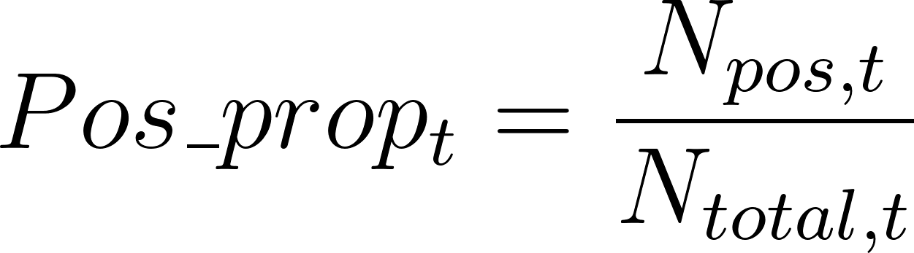
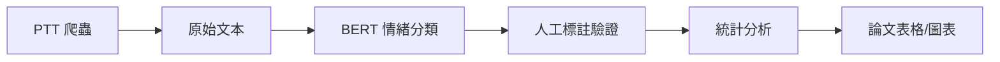

# PTT Stock Sentiment and the TAIEX

**A three-person NTNU study that fine-tuned a multilingual BERT on PTT Stock comments and event-studied retail sentiment against the TAIEX during the 2025 U.S.–China tariff shock.**

[](https://www.python.org/)
[](https://flask.palletsprojects.com/)
[](LICENSE)

The question: when tariff headlines hit in late March and April 2025, did talk on Taiwan’s largest retail forum change shape, move with the index, and carry a short-horizon reversal or volatility signal?

📊 **[Poster](docs/presentations/poster.pdf)** · 📝 **[Thesis](docs/papers/thesis.md)** · 🎨 **[Flowchart](docs/presentations/research_flowchart.pdf)**

---

## English summary

National Taiwan Normal University undergraduate capstone (學習科學學士學位學程). Students on the thesis cover: 王語揚, 呂筱婕, 林峻霆. Advisors: 李良一, 吳清麟. Window: 27 March–16 April 2025, split into pre-event (P1, 27 Mar–2 Apr), shock (P2, 3–9 Apr), and suspension / post-event (P3, 10–16 Apr; 暫緩期).

**Method.** Crawl → clean → label → fine-tune BERT → evaluate → event study.

1. Crawl PTT Stock posts and pushes.
2. Clean timestamps and text, and align forum text with TAIEX daily data (`yfinance` in the study; a local CSV in the pipeline).
3. Label sentiment in three classes (positive / neutral / negative). Three annotators; full agreement kept, 2-of-3 majority kept, total disagreement dropped. Fleiss’ κ was 0.6509 on comments, 0.4452 on post bodies, and 0.2377 on titles, so training used comments only (thesis Table 3-1).
4. Fine-tune `nlptown/bert-base-multilingual-uncased-sentiment` (PyTorch, Hugging Face Transformers). The final V2 set is class-balanced: 250 / 250 / 250 comments in train (thesis Table 3-2).
5. Compare V0, V1, and V2 on a balanced test set of 210 comments, then run inference with V2. The comparison is thesis §3.3.4 (Table 3-3).
6. Event study on two samples: all 21 calendar days for the sentiment-structure tests, and 13 trading days for the market correlations (Spearman, with a 1,000-draw bootstrap).

**What the study reports.** Numbers below are the values printed in the thesis tables. This is one event. Trading-day correlations use N = 13.

- Sentiment mix shifted across P1 / P2 / P3 (one-way ANOVA, N = 21). Neutral share moved from 0.3266 ± 0.044 (P1) to 0.3743 ± 0.022 (P2) and 0.3779 ± 0.020 (P3); ANOVA F = 6.1697, p = 0.0091. Positive share fell from P1 to P2 (post-hoc p = 0.024). Negative share did not rise from P1 to P2 (p = 0.135). Mean daily discussion volume went from 8,275 ± 3,175 (P1) to 29,185 ± 11,042 (P2). Table 4-1 also lists mean daily index returns of −0.85% (P1), −6.50% (P2), and +2.35% (P3).
- On trading days, positive share and cumulative TAIEX return moved together: Spearman ρ = 0.588, p = 0.035. Negative share moved the other way: ρ = −0.560, p = 0.046.
- A two-day change in positive share (Lag-2 momentum) lined up with return more tightly than a one-day change: Lag-2 ρ = 0.782, p = 0.0045; Lag-1 ρ = 0.133, p = 0.665 (thesis Table 4-4, N = 13). The one-day positive-share change versus return is also given in the text as ρ = .133, not significant.
- Comment-volume ratio versus absolute return: ρ = 0.736, p = 0.0041. Volume change versus absolute return: ρ = 0.709, p = 0.0150.
- Bootstrap (1,000 resamples), 95% CI: Lag-2 vs return [0.291, 0.990]; volume vs absolute return [0.271, 0.966]. Both intervals sit above 0 in Table 4-5.

**Stack.** Python, Requests, BeautifulSoup, SQLite, PyTorch, Hugging Face Transformers, pandas, NumPy, SciPy, Matplotlib, Flask, Tkinter, `yfinance`. Base checkpoint: `nlptown/bert-base-multilingual-uncased-sentiment`.

**How to run.** `requirements.txt` is not in this repo (older docs still mention it). Databases matching `*.db` and CSV files are gitignored, so a fresh clone cannot rerun the market pipeline until those local files exist.

```bash
python -m venv venv
source venv/bin/activate  # Windows: venv\Scripts\activate

# Statistics pipeline (pandas, numpy, scipy, python-dotenv).
# Expects database/ptt_data_m.db and data/raw/taiex_open_close.csv
# unless DB_PATH_M and STOCK_CSV say otherwise. See .env.example.
pip install pandas numpy scipy python-dotenv
cp .env.example .env
python run_pipeline.py

# Labeling apps. Web also needs Flask; set FLASK_SECRET_KEY in .env.
pip install flask
python run_web_app.py          # http://localhost:8000
python run_desktop_app.py

# Fine-tune (scripts/finetune_bert.py). Also needs torch, transformers,
# datasets, and scikit-learn. Training JSON is under ptt_raw_consensus/.
```

Labeled JSON already in the repo: `ptt_raw_consensus/`, `ptt_raw_consensus_push_only/`, `ptt_gold_standard/`.

### Representative result

Thesis Figure 4-1: Z-scored daily positive-comment share on PTT Stock and Z-scored TAIEX cumulative return over the same window. The matching rank test is Spearman ρ = 0.588, p = 0.035, N = 13.



*Figure 4-1 from [docs/papers/thesis.md](docs/papers/thesis.md). Source file: `docs/papers/figures/figure_03.png`.*

### My role

This is a three-person team project. I am Roy Wang (王語揚, GitHub [RoyWG925](https://github.com/RoyWG925)). I contributed at every stage of the pipeline alongside my teammates:

- Crawling and data cleaning
- Data labeling
- BERT fine-tuning and evaluation
- Event study and statistical analysis
- Charts and the report

The thesis appendix records the team’s division of labor. Names are in the 作者 section below and on the thesis cover.

---

## 中文說明

## PTT 情緒分析與股市關聯研究系統

> 一個整合 NLP 情緒分析、人工標註工具與統計檢定的完整研究平台

📊 **[查看專題海報](docs/presentations/poster.pdf)** | 📝 **[閱讀論文](docs/papers/thesis.md)** | 🎨 **[研究流程圖](docs/presentations/research_flowchart.pdf)**

論文標題：事件驅動下的網路社群情緒與市場表現：以川普關稅政策期間之 PTT 股票版與台股加權指數為例。

---

## 📌 專案動機 (Motivation)

本專案旨在探討「PTT 股票板情緒」與「台股大盤走勢」之間的關聯性。透過：

1. **自動化爬蟲** — 收集 PTT Stock 板文章與推文
2. **BERT 情緒分類** — 微調 `nlptown/bert-base-multilingual-uncased-sentiment`，做正面 / 中性 / 負面三分類
3. **人工標註系統** — Web 與桌面雙介面，支援多人協作標註
4. **統計檢定** — 變異數分析、Spearman 相關、Bootstrap 信賴區間

最終產出論文用的統計表格與視覺化圖表。數字與樣本定義以 [論文](docs/papers/thesis.md) 為準，英文摘要只引用論文表格裡的原值。

---

## 🚀 快速啟動 (Quick Start)

操作步驟的較短版本在 [QUICKSTART.md](QUICKSTART.md)。那個檔案仍寫著 `pip install -r requirements.txt`，但倉庫裡沒有這份檔案。

### 1. 環境需求

- Python 3.8+
- SQLite 3
- （選用）CUDA，用於 GPU 微調

### 2. 安裝依賴

```bash
python -m venv venv
source venv/bin/activate  # Windows: venv\Scripts\activate

# 統計 pipeline
pip install pandas numpy scipy python-dotenv

# 網頁標註另需 flask；微調另需 torch transformers datasets scikit-learn
```

`*.db` 與 `*.csv` 在 `.gitignore` 裡。重跑 pipeline 需要本機的 `database/ptt_data_m.db` 與 `data/raw/taiex_open_close.csv`（路徑可用環境變數改）。

### 3. 設定環境變數

```bash
cp .env.example .env
# 至少設定 FLASK_SECRET_KEY（只在啟動網頁標註時需要）
python -c "import secrets; print(secrets.token_hex(32))"
```

### 4. 執行資料處理 Pipeline

```bash
python run_pipeline.py
```

等同依序執行 `src/pipeline/data_pipeline.py` 與 `src/pipeline/thesis_stats.py`。

### 5. 啟動標註系統

#### Web 介面（多人協作）

```bash
python run_web_app.py
# http://localhost:8000
```

#### 桌面介面（單人標註）

```bash
python run_desktop_app.py
```

---

## 🏗️ 系統架構 (Architecture)

```
使用者 → Flask Web App → SQLite Database
                ↓
         BERT 模型推論 → 情緒標籤
                ↓
         統計分析模組 → 論文表格/圖表
```

| 模組 | 功能 | 技術棧 |
|------|------|--------|
| `web_app/` | 多人標註系統 | Flask + Jinja2 + SQLite |
| `desktop_app/` | 桌面標註工具 | Tkinter + SQLite |
| `pipeline/` | 資料處理流程 | Pandas + NumPy + SciPy |
| `scripts/` | 實驗性分析腳本 | 爬蟲、微調、統計與視覺化 |

細部說明見 [docs/architecture.md](docs/architecture.md)。

---

## 📊 資料流程 (Data Pipeline)


```mermaid
graph LR
    A[PTT 爬蟲] --> B[原始文本]
    B --> C[BERT 情緒分類]
    C --> D[人工標註驗證]
    D --> E[統計分析]
    E --> F[論文表格/圖表]
```

1. **資料收集** — 爬取 PTT Stock 板指定期間的文章
2. **情緒分類** — 微調 `nlptown/bert-base-multilingual-uncased-sentiment`（論文第 3.3.3 節）。後續推論使用 V2
3. **人工標註** — Web / Desktop 介面，三分制。訓練語料只用留言
4. **統計檢定** — 全日曆日 N = 21 的結構比較，與交易日 N = 13 的 Spearman 相關、Bootstrap CI
5. **視覺化** — Z-score、MinMax、Diff 等對照圖，圖檔在 `assets/charts/` 與 `docs/papers/figures/`

---

## 🔧 技術棧 (Tech Stack)

- **語言與介面**: Python 3、Flask、Tkinter
- **資料庫**: SQLite 3（爬蟲腳本另有 PostgreSQL 路徑）
- **NLP**: PyTorch、Hugging Face Transformers；基礎模型 `nlptown/bert-base-multilingual-uncased-sentiment`
- **資料與統計**: pandas、NumPy、SciPy；股價取得使用 `yfinance`
- **視覺化**: Matplotlib、Seaborn
- **爬蟲**: Requests、BeautifulSoup

---

## 📁 專案結構 (Project Structure)

```
ptt-sentiment-stock-analysis/
├── src/                          # pipeline、標註程式、db 工具
├── scripts/                      # 爬蟲、微調、事件研究與繪圖
├── ptt_raw_consensus/            # 標註後 JSON（train / validation / test）
├── ptt_raw_consensus_push_only/
├── ptt_gold_standard/
├── assets/charts/                # 研究圖
├── docs/                         # 論文、海報、架構說明
├── data/                         # 本地 raw / processed（CSV 不進版控）
├── database/                     # 本地 SQLite（*.db 不進版控）
└── tests/
```

---

## 🔐 安全性注意事項 (Security)

1. 不要 commit `.env`
2. 不要在程式碼裡硬編碼密碼或 API key
3. `*.db` 已在 `.gitignore`
4. Flask `SECRET_KEY` 用 `secrets.token_hex(32)` 產生

---

## 📈 使用範例 (Usage Examples)

### 範例 1：取得資料庫連線

```python
from src.utils.db_utils import get_conn

conn = get_conn()
rows = conn.execute("SELECT COUNT(*) FROM sentiments").fetchone()
print(f"文章總數：{rows[0]}")
conn.close()
```

### 範例 2：查詢標註進度

```python
from src.utils.db_utils import get_conn

conn = get_conn()
rows = conn.execute(
    "SELECT label_id, COUNT(*) FROM manual_labels_articles_all GROUP BY label_id"
).fetchall()
for label_id, count in rows:
    print(f"label_id={label_id}: {count} 筆")
conn.close()
```

這兩個查詢假設本機資料庫裡已有對應資料表。

---

## 🤝 貢獻指南 (Contributing)

1. Fork 本專案
2. 建立功能分支 (`git checkout -b feature/AmazingFeature`)
3. Commit (`git commit -m 'Add some AmazingFeature'`)
4. Push (`git push origin feature/AmazingFeature`)
5. 開啟 Pull Request

---

## 📝 授權條款 (License)

MIT License。見 [LICENSE](LICENSE)。

---

## 👤 作者 (Author)

- **研究者**: 王語揚、呂筱婕、林峻霆
- **機構**: 國立臺灣師範大學
- **聯絡方式**: jg971402@gmail.com

---

## 🙏 致謝 (Acknowledgments)

- [Hugging Face](https://huggingface.co/) 上的 `nlptown/bert-base-multilingual-uncased-sentiment`，以及 Transformers 函式庫
- PTT 社群提供的公開討論

---

## 📚 相關論文 (Related Papers)

- 📊 [專題海報](docs/presentations/poster.pdf)
- 📝 [論文全文](docs/papers/thesis.md)
- 🎨 [研究流程圖](docs/presentations/research_flowchart.pdf)

```bibtex
@misc{ptt-sentiment-2025,
  author = {王語揚},
  title = {事件驅動下的網路社群情緒與市場表現：以川普關稅政策期間之 PTT 股票版與台股加權指數為例},
  year = {2025},
  publisher = {GitHub},
  url = {https://github.com/RoyWG925/ptt-sentiment-stock-analysis}
}
```

---

**最後更新**: 2026-10-08
