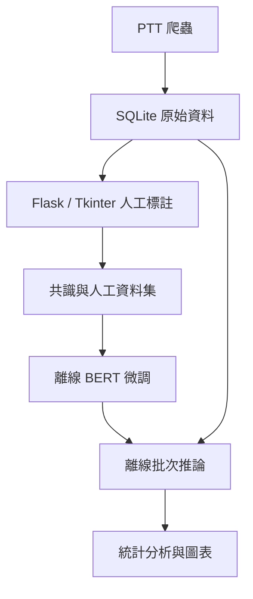
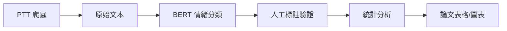

# PTT 情緒分析與股市關聯研究系統

> 一個整合 NLP 情緒分析、人工標註工具與統計檢定的完整研究平台

[](https://www.python.org/)
[](https://flask.palletsprojects.com/)
[](LICENSE)

📊 **[查看專題海報](docs/presentations/poster.pdf)** | 📝 **[閱讀論文](docs/papers/thesis.md)** | 🎨 **[研究流程圖](docs/presentations/research_flowchart.pdf)**

---

## 📌 專案動機 (Motivation)

本專案旨在探討「PTT 股票板情緒」與「台股大盤走勢」之間的關聯性。透過：

1. **自動化爬蟲** - 收集 PTT Stock 板文章與推文
2. **BERT 情緒分類** - 使用微調後的 Transformer 模型進行三分類（正面/中性/負面）
3. **人工標註系統** - 提供 Web 與桌面雙介面，支援多人協作標註
4. **統計檢定** - 卡方檢定、Spearman 相關性、Bootstrap 信賴區間

最終產出可用於學術論文的統計表格與視覺化圖表。

---

## 🚀 快速啟動 (Quick Start)

### 可直接重現：公開資料切分稽核（Python 標準函式庫）

```bash
python -m unittest tests.test_split_audit -v
python scripts/audit_dataset_splits.py --output docs/split-audit.json
# 嚴格模式：發現跨集合文本重複時以 exit code 1 結束
python scripts/audit_dataset_splits.py --strict
```

此流程只讀取公開 JSON，輸出樣本數、類別分布、原始檔案 SHA256、完全相同／正規化後重複文本的數量；**不會執行模型、重訓或驗證 F1**。結果見 [split-audit.json](docs/split-audit.json)。原始資料保留不變。

### 研究結果與重現範圍

| 項目 | 公開證據與限制 |
|------|----------------|
| 模型 | 訓練程式使用 `nlptown/bert-base-multilingual-uncased-sentiment`；V2 從 V1 checkpoint 繼續微調。不是 CKIP BERT。 |
| 歷史成績 | 論文報告 gold test N=210 上 V0 macro F1=0.475、V1=0.232、V2=0.683。這些為歷史報告值，本次稽核未重新執行模型。 |
| 公開資料 | V1 train/validation/test=420/90/90；push-only=210/45/45；gold test=210（每類 70）。Raw test 與 gold test 是不同集合。 |
| 未公開重現材料 | V2 的 `v2_training_set_master` / `v2_validation_set_master` SQLite 資料表、V1/V2 模型 checkpoint、完整套件版本鎖定與逐筆預測結果。現有程式無法從公開檔案獨立重現 V2 成績。 |
| 資料獨立性 | 稽核發現公開切分有少量重複文本，包含一筆 gold test 文本也出現在 V1 train。V2 繼承 V1 權重，因此需檢查完整訓練歷程；重複短語本身不足以推定分數膨脹。 |
| 參數差異 | 程式 V1 為 batch=8、epochs=3；V2 為 batch=32、epochs=8、lr=2e-5。論文記載 batch=16、epochs=4；需要原始執行紀錄釐清哪組產生所報結果。 |

切分 JSON 未保留文章／使用者／時間識別，無法驗證依文章、作者或時間分組後的獨立性。V2 master tables 未提供，因此目前也無法確認 V2 train/validation 與 gold test 是否完全分離。Gold test 的平衡類別分布不代表實際 PTT 流量分布。

### 完整研究流程（需要自備資料與模型）

以下保留原研究的操作方式，**不是目前可從乾淨 checkout 完整啟動的 demo**。資料庫／股價 CSV／模型權重需另行提供；套件清單尚未完整封裝。[原快速啟動指南](QUICKSTART.md) 也有相同前提。

### 1. 環境需求

- Python 3.8+
- SQLite 3
- (選用) CUDA 11.8+ for GPU 加速

### 2. 安裝依賴

```bash
# 建立虛擬環境
python -m venv venv
source venv/bin/activate  # Windows: venv\Scripts\activate

# 完整 app / ML 套件清單尚未公開封裝。
# 上方資料切分稽核與 fixture tests 不需 pip install。
```

### 3. 設定環境變數

```bash
# 複製範本
cp .env.example .env

# 編輯 .env 檔案，填入你的設定
# DB_PATH=database/ptt_data.db
# FLASK_SECRET_KEY=<YOUR_RANDOM_SECRET_KEY>
```

### 4. 執行資料處理 Pipeline

```bash
# Step 1: 資料清洗與特徵工程
python src/pipeline/data_pipeline.py

# Step 2: 統計分析
python src/pipeline/thesis_stats.py
```

### 5. 啟動標註系統

#### Web 介面（多人協作）
```bash
python src/web_app/app.py
# 開啟瀏覽器訪問 http://localhost:8000
```

#### 桌面介面（單人標註）
```bash
python src/desktop_app/advanced_label_tool.py
```

---

## 🏗️ 系統架構 (Architecture)


```mermaid
flowchart TD
    PTT[PTT 爬蟲] --> DB[SQLite 原始資料]
    DB --> UI[Flask / Tkinter 人工標註]
    UI --> LABELS[共識與人工資料集]
    LABELS --> TRAIN[離線 BERT 微調]
    TRAIN --> INFER[離線批次推論]
    DB --> INFER
    INFER --> STATS[統計分析與圖表]
```

Web app 負責人工標註；模型訓練與推論由獨立 Python scripts 執行，沒有整合成線上模型服務。

### 核心模組說明

| 模組 | 功能 | 技術棧 |
|------|------|--------|
| `web_app/` | 多人標註系統 | Flask + Jinja2 + SQLite |
| `desktop_app/` | 桌面標註工具 | Tkinter + SQLite |
| `pipeline/` | 資料處理流程 | Pandas + NumPy + SciPy |
| `scripts/` | 實驗性分析腳本 | 各種統計與視覺化工具 |

---

## 📊 資料流程 (Data Pipeline)


```mermaid
graph LR
    A[PTT 爬蟲] --> B[原始文本]
    B --> C[BERT 情緒分類]
    C --> D[人工標註驗證]
    D --> E[統計分析]
    E --> F[論文表格/圖表]
```

1. **資料收集** - 爬取 PTT Stock 板指定期間的文章
2. **情緒分類** - 使用從 `nlptown/bert-base-multilingual-uncased-sentiment` 微調的模型
3. **人工標註** - 透過 Web/Desktop 介面進行三分制標註
4. **統計檢定** - 卡方檢定、Spearman 相關性、Bootstrap CI
5. **視覺化** - 生成 Z-score、MinMax、Diff 等對比圖表

---

## 🔧 技術棧 (Tech Stack)

- **後端框架**: Flask 2.0+
- **資料庫**: SQLite 3
- **NLP 模型**: Hugging Face Transformers (BERT)
- **資料處理**: Pandas, NumPy, SciPy
- **視覺化**: Matplotlib, Seaborn
- **桌面 GUI**: Tkinter

---

## 📁 專案結構 (Project Structure)

```
ptt-sentiment-stock-analysis/
├── src/              # 核心程式碼
├── scripts/          # 實驗性腳本
├── data/             # 資料檔案（raw/processed/outputs）
├── assets/           # 圖表與靜態資源
├── database/         # SQLite 資料庫
├── docs/             # 技術文件
└── tests/            # 單元測試
```

詳細架構請參考 [docs/architecture.md](docs/architecture.md)

---

## 🔐 安全性注意事項 (Security)

⚠️ **重要提醒**：

1. **絕對不要** commit `.env` 檔案到 Git
2. **絕對不要** 在程式碼中硬編碼密碼或 API Keys
3. 資料庫檔案 (`*.db`) 已加入 `.gitignore`
4. 使用 `secrets.token_hex(32)` 生成 Flask SECRET_KEY

---

## 📈 使用範例 (Usage Examples)

### 範例 1：取得資料庫連線

```python
from src.utils.db_utils import get_conn

conn = get_conn()
rows = conn.execute("SELECT COUNT(*) FROM sentiments").fetchone()
print(f"文章總數：{rows[0]}")
conn.close()
```

### 範例 2：查詢標註進度

```python
from src.utils.db_utils import get_conn

conn = get_conn()
rows = conn.execute(
    "SELECT label_id, COUNT(*) FROM manual_labels_articles_all GROUP BY label_id"
).fetchall()
for label_id, count in rows:
    print(f"label_id={label_id}: {count} 筆")
conn.close()
```

---

## 🤝 貢獻指南 (Contributing)

歡迎提交 Issue 或 Pull Request！

1. Fork 本專案
2. 建立你的功能分支 (`git checkout -b feature/AmazingFeature`)
3. Commit 你的變更 (`git commit -m 'Add some AmazingFeature'`)
4. Push 到分支 (`git push origin feature/AmazingFeature`)
5. 開啟 Pull Request

---

## 📝 授權條款 (License)

本專案採用 MIT License - 詳見 [LICENSE](LICENSE) 檔案

---

## 👤 作者 (Author)

- **研究者**: [王語揚]、[呂筱婕]、[林峻霆]
- **機構**: [國立臺灣師範大學]
- **聯絡方式**: [jg971402@gmail.com]

---

## 🙏 致謝 (Acknowledgments)

- [CKIP Lab](https://ckip.iis.sinica.edu.tw/) - 提供預訓練中文 BERT 模型
- [Hugging Face](https://huggingface.co/) - Transformers 函式庫
- PTT 社群 - 提供公開討論資料

---

## 📚 相關論文 (Related Papers)

### 研究文件
- 📊 [專題海報](docs/presentations/poster.pdf) - 研究成果視覺化展示
- 📝 [論文全文](docs/papers/thesis.md) - 完整研究論文（可在 GitHub 直接閱讀）
- 🎨 [研究流程圖](docs/presentations/research_flowchart.pdf) - 方法論視覺化

### 引用格式

如果本專案對你的研究有幫助，請引用：

```bibtex
@misc{ptt-sentiment-2025,
  author = {王語揚},
  title = {事件驅動下的網路社群情緒與市場表現：以川普關稅政策期間之 PTT 股票版與台股加權指數為例},
  year = {2025},
  publisher = {GitHub},
  url = {https://github.com/RoyWG925/ptt-sentiment-stock-analysis}
}
```

---

**最後更新**: 2026-2-26
